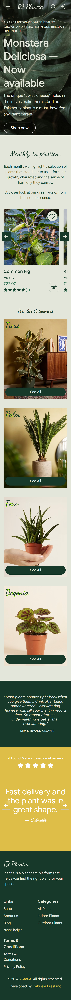
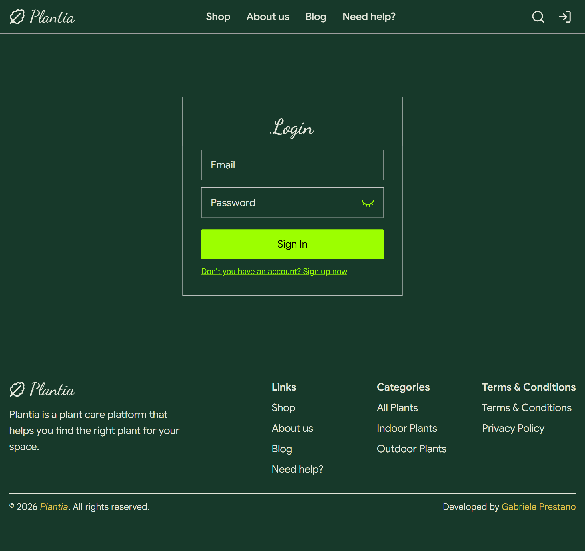
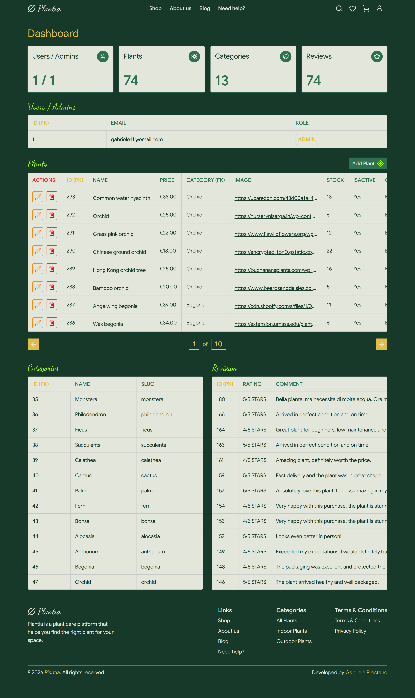

# 🌿 Plantia - Full Stack PEAN E-Commerce

Full-stack E-commerce built with the PEAN Stack (PostgreSQL, Express, Angular 20, Node.js). Features: JWT Auth, Admin Dashboard (CRUD), Real-time Toast notifications, Wishlist/Cart management, and advanced filtering with Prisma ORM. Fully responsive with TailwindCSS & PrimeNG.

🚀 **[Live Demo on Render](https://pean-stack-plantia.onrender.com)**

---

## 🛠️ Tech Stack

### Front-End

### Back-End

---

## ✨ Features
- **Full CRUD**: Manage plants, categories, and reviews.
- **Shopping Cart & Wishlist**: Fully functional cart & wishlist with persistent state.
- **Authentication**: Secure Login/Register system using JWT and Cookies.
- **Modern UI**: Smooth transitions, mobile-first responsiveness, and intuitive UX.
- **Prisma Integration**: Advanced filtering and relational data handling.

---

- ## 📸 Screenshots

